# 实验二 DWT变换域图像信息隐藏实验


## 实验目的

- 成功实现DWT变换域图像信息隐藏
- 隐藏后的图像进行多组性能测试
- 统计相关性能指标参数数据，分析影响实验的相关因素
- 分析算法的不足，提出相关改进方案和性能验证

## 实验环境

- MatlabR2021a
- Windows11

## 实验图像

- 多幅实验图像

## 实验内容

1. 编写DCT算法，实现数字水印的嵌入和逆向提取。
1. 分析嵌入水印前后PSNR（峰值信噪比）和MSE（均方方差）的数值变化，分析其中的原因。
1. 对嵌入水印后的图像进行攻击测试（叠加椒盐噪声和随机剪切），检验其鲁棒性。
1. 分析传统DCT变换算法的不足，针对其不足进行算法改良，并检验改良效果。

## 实验步骤

### 1、读取测试图像，并对图像进行DWT变换实现图片的信息隐藏

#### 1.1通过Matlab自带的`imread函数`读取实验所用的载体图像和隐藏信息图像

```matlab
file_name='数字图像.bmp';%载体图像
cover_object=double(imread(file_name));
figure(1)
imshow(cover_object,[])
title('原始图像')

mc=size(cover_object,1);
nc=size(cover_object,2);
file_name='隐藏信息.bmp';%隐藏的信息图像
message=double(imread(file_name));
```

#### 1.2对原始图像实施小波变换，并实现隐藏图像的嵌入

##### 1.2.1实验原理

小波变换在图像处理中的基本思想是把图像进行多分辨率分解，生成不同空间和独立频带的子图像，然后对子图像的系数进行处理。图像是二维信号，需要在行和列上分别进行一维小波变换阁。图像经过一次小波变换后，被分解成下一级4个子带。

小波图像的各个子带分别对应了原图像在不同尺度和不同分辨率下的细节。最低频子带 LL2是原图像的逼近，原 图像的主要内容都体现在这个子带的数据中。小波图像的各个高频子带是原图像中边缘 、轮廓和纹理等细节信息的体现 ，并且各个子带所表示 的边缘 、轮廓等信息的方向是 不同的，其中HL子带表示垂直方向，LH子带表示水平方向，而对角方向则集中体现在HH子带中 。 

##### 1.2.2水印的嵌入

设原始图像为：

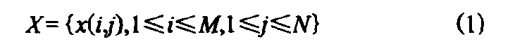

二值水印图像为:

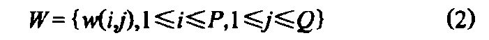

则数字水印的嵌入过程如图:

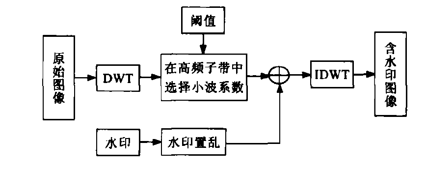

1.水印的随机置乱与降维 。为了消除二值水印图像的象素空间相关性 ,提高数字水印算法的鲁棒性 ，确保图像某一部分受到破坏后仍能全部或部分的恢复水 印，首先应对二值水印图像进行置乱变换 。将置乱后的水印图像利用行扫描形成一维向量 ，并依次标号为 l~PxQ，从而得到由原二值水印图像转换而来的一维数字水印序列。

​															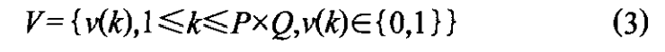

2.离散小波变换 。对原始图像实施L级小波变换 ，得到一 个逼近子图(最低频子带)和 3三个细节子图(高频子带)。小波变换级数的确定取决于原始图像的大小和待嵌入数字水印信息的长度 ，小波变换级数越大 ，嵌入水印的隐藏效果就越好。

3.选取纹理子块。将小波图像的高频子带划分成大小为 2x2的图像Bk子块 。计算每一个图像子块Bk的熵值和方 差。熵值较小的图像子块应 该是平滑块 ，而熵值比较大的图像子块是纹理块或边缘块 。纹理子块对应的方差较 小，边缘子块对应的方差比较大 。选取合适的熵阈值和方差阈值，便可以得到纹理子块 **Uk**（k=1，2，…,pxQ)。

4.水印嵌入。修改所选择的纹理子块内的小波系数的值G，以完成数字水印的嵌入 。其嵌入公式为：

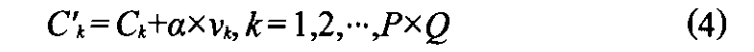

式中 ：Ck—— 纹理子块内的原小波系数值Vk —— 一维数字水印序 列V的第k个分量 ，Ck嵌入水印后纹理子块内的新小波系数值，数字水印嵌入的固定深度 。 将修改过的高频子带结合最 低频子带进行小波逆变换 ，得到嵌入 有数字水印的含水印图像。

```matlab
figure(2)
imshow(message,[])
title('隐藏信息')
mm=size(message,1);
nm=size(message,2);
[ca,ch,cv,cd]=dwt2(cover_object,'haar');
ca1=ca;
% m=moviein(30);
qiangdu=1;
% for qiangdu=1:30
for i=1:nm
    for j=1:nm
        if(message(i,j)==0)
            ca1(i,j)=ca(i,j)+qiangdu;
        end
    end
end
watermarked_image=idwt2(ca1,ch,cv,cd,'haar');
watermarked_image_round=round(watermarked_image);
watermarked_image_uint8=uint8(watermarked_image_round);
```

得到的效果图如下：

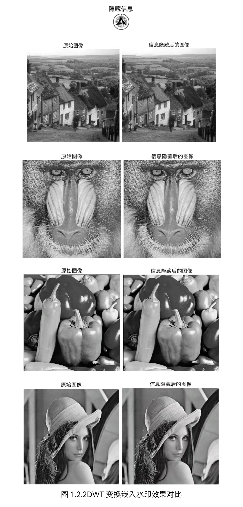

通过直观视觉可以看到，DWT变换在将隐藏信息图片嵌入载体图片后，图片质量和呈现效果从肉眼角度几乎没有任何变化，能够较好的达到图像信息隐藏的目标。

### 2、对嵌入水印后的图片进行水印提取，并分析前后图片变化

#### 2.1提取原理

对之前嵌入水印后的加密图像进行反向算法，提取嵌入其中的水印，从待检测的图像中提取水印的过程类似于水印的嵌入过程，根据水印的嵌入过程反推来提取水印。

#### 2.2提取步骤

- 步骤1：设 I′是待测图像，对其进行一级小波变换，提取低频系数。
- 步骤2：对低频系数进行8×8分块，每一块分别进行DCT 变换，而后提出嵌入水印 的 DCT 变换块 Bi，如果块 Bi（ u1，v1） ≥ Bi（ u2， v2）则提取出‘＋1’，否则提取出‘－1’．

#### 2.3实现代码

```matlab
%%%%%%%%%%%

clc;
clear all;
close all

%信息隐藏提取

file_name1='隐藏信息.bmp';
message=double(imread(file_name1));
mm=size(message,1);
nm=size(message,2);
%%%%%%%%%%%

file_name2='信息隐藏后.bmp';
watermarked_image=double(imread(file_name2));

figure;
imshow(uint8(watermarked_image));
title('隐藏信息的图像')
mw=size(watermarked_image,1);
nw=size(watermarked_image,2);
[ca1,ch1,cv1,cd1]=dwt2(watermarked_image,'haar');

temp=load('im.mat');
cover_object=temp.im;
[ca2,ch2,cv2,cd2]=dwt2(cover_object,'haar');
watermarkr=ca1-ca2;

watermark=ones(mm);
for i=1:mm
    for j=1:nm
        if(watermarkr(i,j)~=0)
        watermark(i,j)=0;
        end
    end
end
watermark1=uint8(watermark);
figure
imshow(watermark1,[]);
title('恢复出的隐藏信息')
```

得到的具体效果图如下：

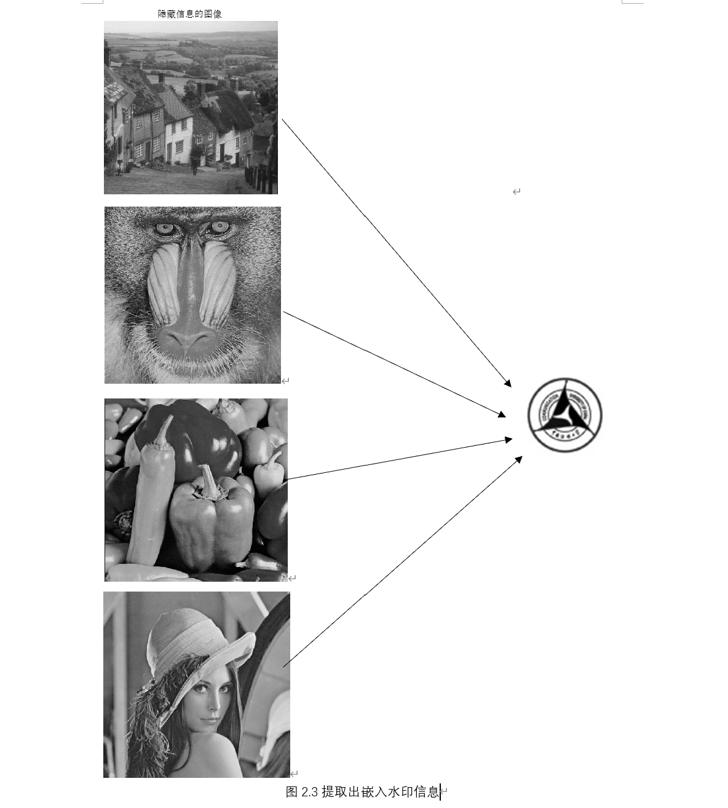

能够看到其提取的水印信息较为完整，能够合理地还原对应的隐藏水印信息。

### 3、性能指标测试与算法改良

#### 3.1嵌入水印后的峰值信噪比

对嵌入水印后的图像进行测算，得出峰值信噪比：

| 嵌入水印后的图像 | PSNR    |
| ---------------- | ------- |
| a                | 61.4006 |
| b                | 61.9079 |
| c                | 67.5345 |
| d                | 61.9782 |
| e                | 62.2234 |
| f                | 68.2406 |
| g                | 62.0166 |
| h                | 67.3201 |
| i                | 67.8931 |

#### 3.2抗攻击能力测试

##### 3.2.1攻击形式

为了检测水印的鲁棒性 ，对含水 印图像进 行一些攻击 。 常见的攻击方式包括叠加噪声、几何剪切、JPEG压缩 等方式，由于DCT为离散余弦变换，此处我采用了叠加**椒盐噪声**和**随机剪切**的方式对图像进行攻击，通过改变椒盐噪声的方差和裁切位置进行多次攻击。

##### 3.2.2攻击实现代码：

- 对图像进行噪声攻击：
  - 椒盐噪声（salt & pepper noise）是数字图像的一个常见噪声，所谓椒盐，椒就是黑，盐就是白，椒盐噪声就是在图像上随机出现黑色白色的像素。椒盐噪声是一种因为信号脉冲强度引起的噪声

```matlab
%%%%%%%%%%%

clc;
clear all;
close all

%信息隐藏提取

file_name='隐藏信息.bmp';
message=double(imread(file_name));
mm=size(message,1);
nm=size(message,2);
%%%%%%%%%%%

file_name='信息隐藏后.bmp';
watermarked_image=double(imread(file_name));

figure;
imshow(uint8(watermarked_image));
title('隐藏信息的图像')
mw=size(watermarked_image,1);
nw=size(watermarked_image,2);

%加入噪声干扰，测试信息恢复情况

watermarked_image = imnoise(uint8(watermarked_image),'salt & pepper',0.05);%加入椒盐噪声（方差0.02）
figure;
imshow(watermarked_image);
title('噪声干扰后的隐藏信息图像')
watermarked_image=double(watermarked_image);
[ca1,ch1,cv1,cd1]=dwt2(watermarked_image,'haar');
temp=load('im.mat');
cover_object=temp.im;
[ca2,ch2,cv2,cd2]=dwt2(cover_object,'haar');
watermarkr=ca1-ca2;

watermark=ones(mm);
for i=1:mm
    for j=1:nm
        if(watermarkr(i,j)~=0)
        watermark(i,j)=0;
        end
    end
end
watermark1=uint8(watermark);
figure
imshow(watermark1,[]);
title('恢复出的隐藏信息')
```

- 对图像进行随机剪切

```matlab
%%%%%%%%%%%
clc;
clear all;
close all
%信息隐藏提取

file_name='隐藏信息.bmp';
message=double(imread(file_name));
mm=size(message,1);
nm=size(message,2);
%%%%%%%%%%%
file_name='信息隐藏后.bmp';
watermarked_image=imread(file_name);

figure;
imshow(watermarked_image);
title('隐藏信息的图像')
mw=size(watermarked_image,1);
nw=size(watermarked_image,2);

%对图像进行随机剪切，测试信息恢复情况
watermarked_image(230:250,30:50)=255;
watermarked_image(130:150,130:150)=255;
figure;
imshow(watermarked_image);
title('剪切后的隐藏信息图像')
watermarked_image=double(watermarked_image);
[ca1,ch1,cv1,cd1]=dwt2(watermarked_image,'haar');
temp=load('im.mat');
cover_object=temp.im;
[ca2,ch2,cv2,cd2]=dwt2(cover_object,'haar');
watermarkr=ca1-ca2;

watermark=ones(mm);
for i=1:mm
    for j=1:nm
        if(watermarkr(i,j)~=0)
        watermark(i,j)=0;
        end
    end
end
watermark1=uint8(watermark);
figure
imshow(watermark1,[]);
title('恢复出的隐藏信息')
```

##### 3.3.3效果呈现

- **对嵌入水印信息的图像叠加不同方差等级的椒盐噪声进行攻击测试**：

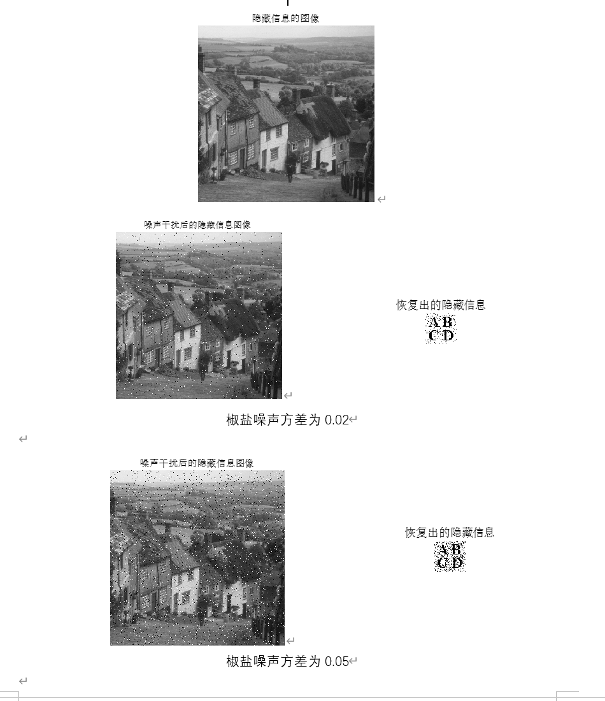

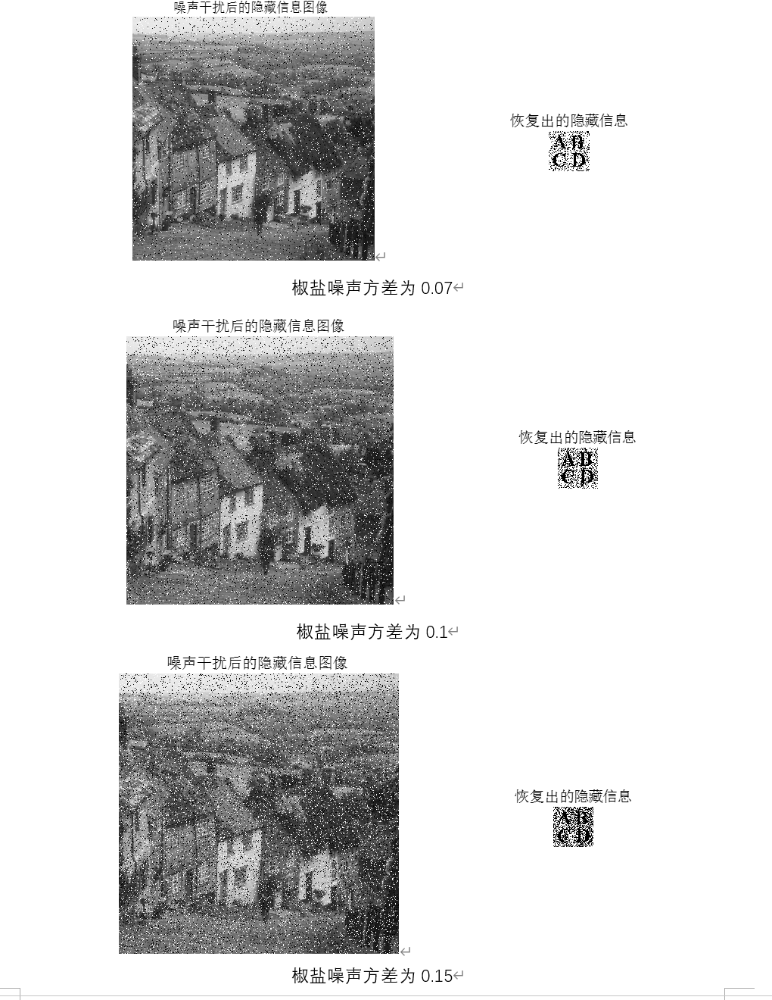

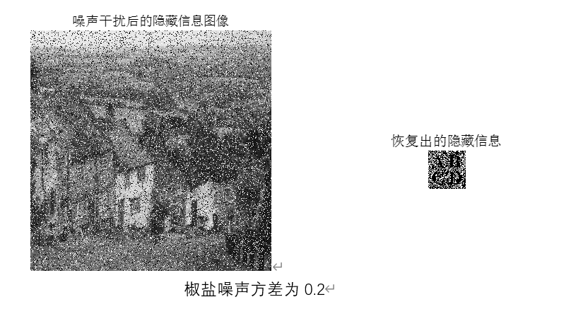

再计算上述不同方差噪声下图像的**PSNR（峰值信噪比）**和**MSE（均方方差）**

| 椒盐噪声方差 | PSNR（峰值信噪比） | MSE（均方方差） |
| :----------- | ------------------ | --------------- |
| 0.02         | 11.8261            | 0.0657          |
| 0.05         | 8.2207             | 0.1506          |
| 0.07         | 6.7736             | 0.2102          |
| 0.1          | 5.2104             | 0.3013          |
| 0.15         | 3.8835             | 0.4089          |
| 0.2          | 2.9913             | 0.5022          |

跟据不同方差噪声下图像的具体效果和提取出的隐藏信息的视觉感官能够看到，随着椒盐噪声的方差逐渐增大，对于图像的干扰效果逐渐增强，图像逐渐失真，同时提取的隐藏信息也由于收到噪声干扰，逐渐出现失真；对比不同方差噪声下的PSNR值和MSE值，能够清楚地反映，随着噪声干扰效果增强，PSNR逐渐减小，MSE逐渐增大，反映了图像的结构失真和图像质量逐渐下降。

- **对图像进行随机剪切攻击：**

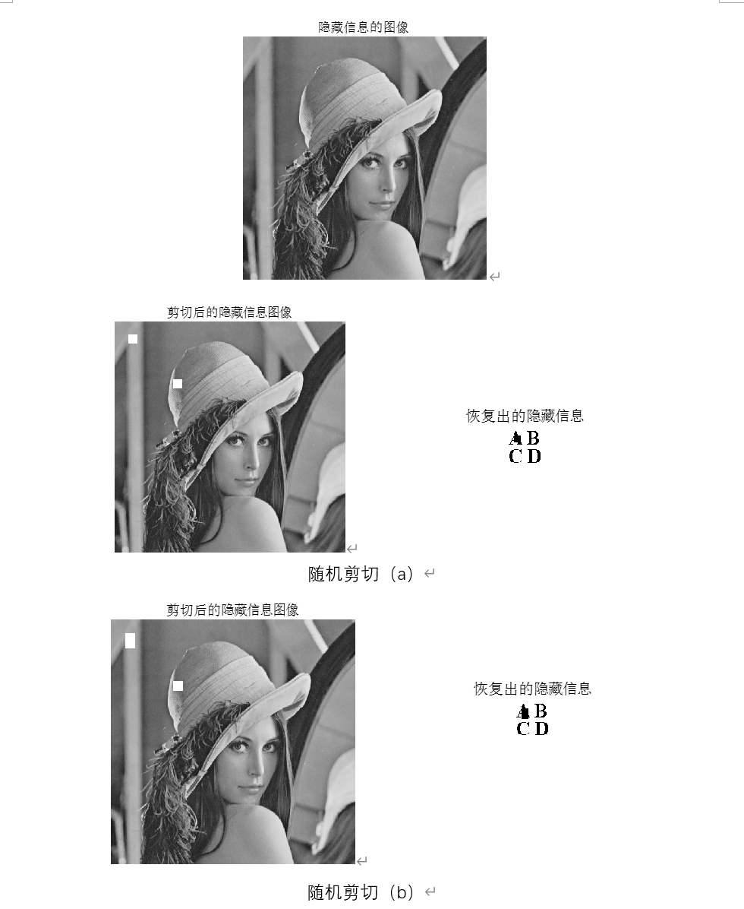

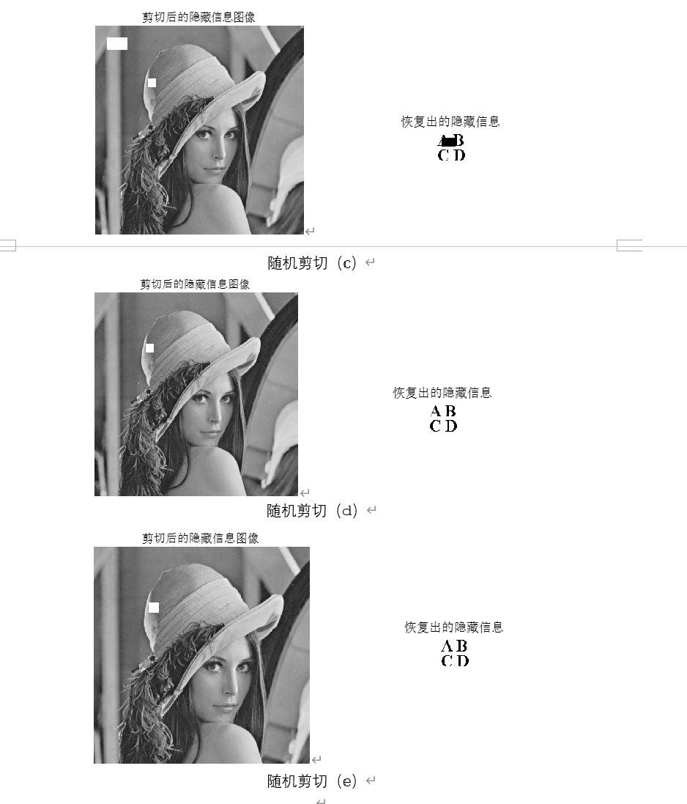

此处通过坐标剪切，对于隐藏信息的图像剪切某几个像素块，并再次提取隐藏的水印信息，同时计算**PSNR（峰值信噪比）**和**MSE（均方方差）**对剪切攻击后的图像质量进行比较

| 剪切坐标    | PSNR（峰值信噪比） | MSE（均方方差） |
| ----------- | ------------------ | --------------- |
| 30:50,30:50 | 17.7985            | 0.0166          |
| 30:60,30:50 | 15.7493            | 0.0266          |
| 30:60,30:80 | 11.1960            | 0.0759          |
| 30:60,80:80 | 33.1133            | 4.8828e-04      |
| 80:60,80:80 | inf                | 0               |

通过对剪切后对图像的视觉观察可以看到，随机剪切攻击具有一定的随机性，剪切的位置坐标、剪切像素块大小等多种因素都是随机的，因此对于不同剪切情况下的隐藏图像和提取的隐藏信息造成的结果也会不同。

#### 3.3分析算法不足以及改进方案

##### 3.3.1图像对于对于噪声干扰其鲁棒性不够理想

根据上述算法，当叠加的椒盐噪声方差过大时，会导致隐藏信息的图像失真格外严重，也会导致破坏嵌入水印，导致提取出来的水印信息也会受到一定程度的破坏，从而影响到隐藏信息的内容，因此需要对算法进行一定程度的改良和优化，使得承受更大范围的噪声干扰。

**改进方案**

对水印图像像素进行加解密，将图像划分成 2×4 的块，将相邻两个像素点的值整合成16bit 的数据。变换成 2×2 的数据块，数据量缩减为原来的一半，将这4个数据作为数据子分组。图像解密与加密过程相反，将解密后得到的16bit数据拆分成两个8bit 数据，每个8bit 数据对应一个点的像素值，从而得到解密后的水印图像。

**二维离散余弦变换（DCT）及反变换（IDCT）：**

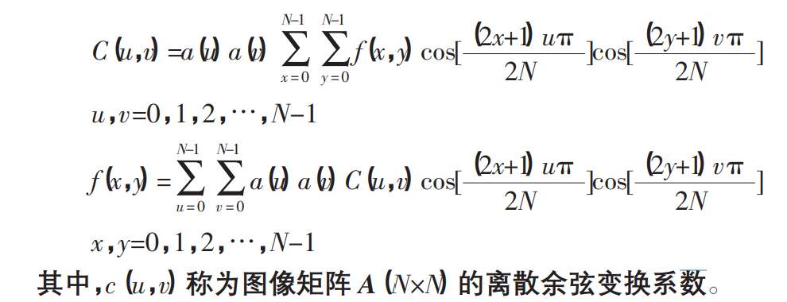

**改进效果展示：**

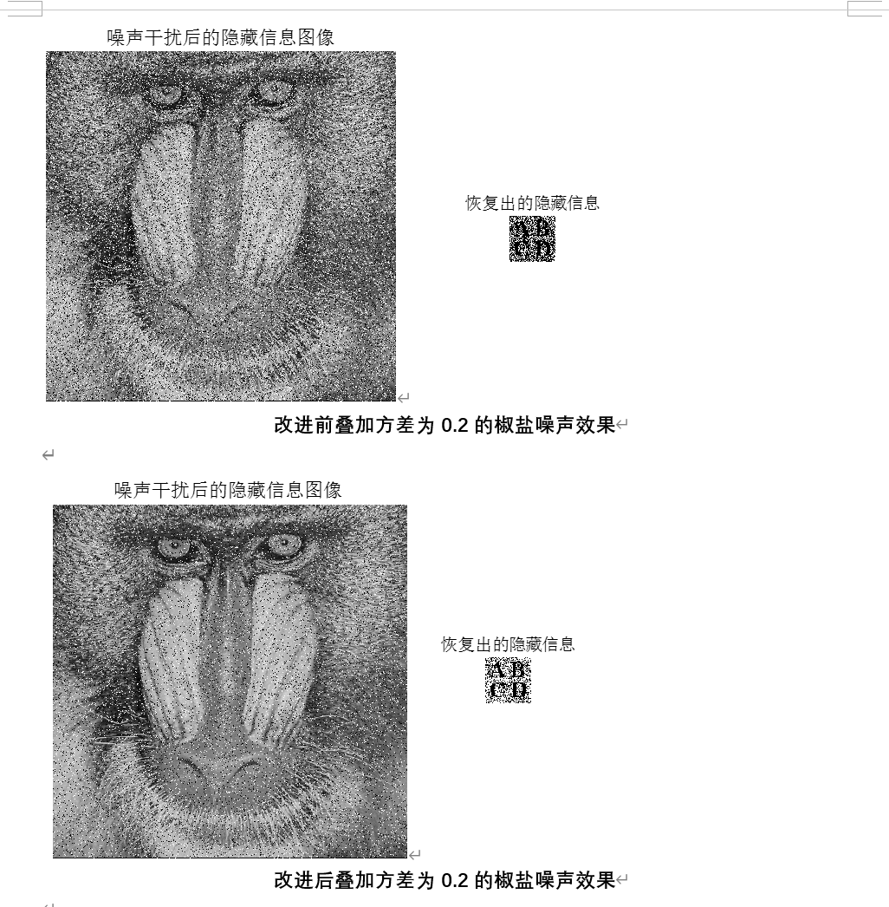

对相同的已嵌入的隐藏信息图像进行方差为0.2的噪声叠加干扰，比较改进前后的**PSNR（峰值信噪比）**和**MSE（均方方差）**

|            | PSNR（峰值信噪比） | MSE（均方方差） |
| ---------- | ------------------ | --------------- |
| **改进前** | 3.0960             | 0.4902          |
| **改进后** | 5.3681             | 0.2905          |

能够从视觉感官和测量的数据清楚看到，在改进了DCT变换算法后，图像的鲁棒性有了一定程度的提高，能够更好的抵抗高强度的噪声干扰攻击。

## 总结

本次实验是基于DWT变换域实现了对于数字水印的嵌入和提取从而达到了信息隐藏的效果，基于人眼视觉特性的小波变换数字水印算法，能够依据人眼视觉特性 ，将水印信息嵌入到小波变换域中，从而提供不同的空间支持区域 ，实现局部水印和全局水印之双重目的。

同时对于嵌入水印后的图像也进行PSNR和MSE的测量对比，并对于DCT加密算法后的图像进行了攻击检验，验证其鲁棒性，可以得出结论：

- 随着椒盐噪声的方差增大，即叠加噪声效果逐渐增强，会使得图像的PSNR逐渐减小，MSE逐渐增大，对应的效果是图像结构失真，图像视觉感官效果失真，提取的隐藏信息也会同样收到影响。
- DCT变换加密得到的加密图像在面对随机剪切时具有一定的抗裁剪性，能够一定程度的抵御裁剪，但也会由于剪切的位置、像素块大小等因素导致最后实现的效果出现不同。
- 面对抵御椒盐噪声干扰，在传统的DCT变换算法基础上进行了改进，对水印图像像素进行加解密，将图像划分成 2×4 的块，将相邻两个像素点的值整合成16bit 的数据。变换成 2×2 的数据块，数据量缩减为原来的一半，将这4个数据作为数据子分组，再进行相应的水印嵌入和提取，从而能有效提高DCT算法变换图像的鲁棒性。

## 参考文献资料

【1】傅德胜,黄伟.基于小波变换的数字水印及Matlab实现.计算机工程与设计. 2008.04.018

【2】李鑫,余生晨,薛阳.基于小波变换域的数字图像水印算法的研究.贵州工业大学学报(自然科学版). 2004,(03)

【3】刘方,杨峰.改进的基于 DCT 的加密盲水印算法.计算机工程与应用. 2009,45(13)

【4】郭亮.图像数字水印技术研究.西安工业大学陕西省.2013年第07期